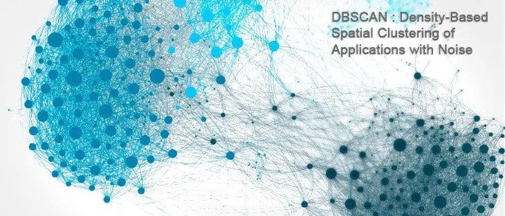

# Round 1A: PDF Heading Extraction

## Overview


This solution extracts the **document title** and a **hierarchical outline of headings** (H1, H2, H3) from PDF files up to 50 pages. It processes all PDFs placed in the input directory and writes corresponding JSON outlines to the output directory.

---

## How to Run

1. **Build the Docker image:**

```bash
docker build --platform linux/amd64 -t adobe-1a:v1 .
```

2. **Run the container:**

```bash
docker run --rm -v $(pwd)/input:/app/input -v $(pwd)/output:/app/output --network none adobe-1a:v1
```

* Place your PDF files inside the local `input` folder before running.
* Extracted JSON outlines will be saved to the local `output` folder.

---

## Implementation Details

### PDF Parsing

* Utilizes [`pdfminer.six`](https://pdfminersix.readthedocs.io/) for detailed PDF layout and text extraction.
* Extracts text blocks along with **font size** and **font weight (boldness)** metadata.
* These visual cues help differentiate headings from regular body text.

### Heading Detection

* Groups text blocks by their **vertical positions** (y-coordinates) on each page using **DBSCAN clustering**.
* Within each cluster, the blocks with the **largest font sizes** (and optionally bold style) are identified as candidate headings.

> **About DBSCAN:**
> DBSCAN (Density-Based Spatial Clustering of Applications with Noise) is a robust clustering algorithm that groups points closely packed together, marking points in sparse regions as noise. By clustering on vertical text positions (`y0`), it effectively groups lines that visually belong to the same heading cluster or section header, even with inconsistent spacing or layouts. This enables flexible handling of various PDF structures.



### Heading Levels

* Heading levels (H1, H2, H3) are assigned dynamically based on **unique font sizes** in descending order.
* This adaptive approach avoids hardcoded thresholds and improves compatibility across diverse PDF documents.

### Title Extraction

* The largest font size text block on the **first page** is selected as the document **title**.

### Modularity

* The code is structured into clear, reusable modules: text extraction, heading clustering, and PDF processing.
* This design supports easy extension and reuse, such as for Round 1B of the challenge.

---

## Why This Works

* **Preserves Visual Hierarchy:** Leverages font size and style cues to infer document structure closely aligned with human perception.
* **Robust Clustering:** DBSCAN groups nearby headings despite variable spacing and layout differences.
* **Avoids Hardcoding:** Dynamic font size-based heading classification improves generalization across PDFs and multilingual documents.
* **Containerized & Offline:** The Docker container runs entirely offline on CPU, ensuring consistency, reproducibility, and adherence to hackathon constraints.

---

## Dependencies

* [`pdfminer.six`](https://pdfminersix.readthedocs.io/) — Precise PDF layout and text extraction.
* [`scikit-learn`](https://scikit-learn.org/stable/) — Provides DBSCAN clustering for heading grouping.
* [`numpy`](https://numpy.org/) — Efficient numerical operations for clustering input preparation.


## Team Members
- [Aman Jaiswal](https://github.com/amanjaiswal7236)
- [Siddhid Sambrut Dani](https://github.com/siddhid1)
- [Soubhik Kumar Gon](https://github.com/zakhaev26)